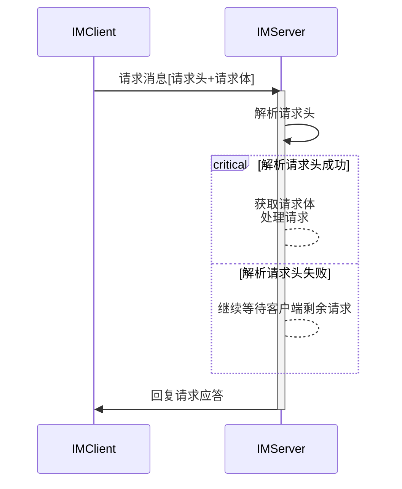

# IM通信协议

IM客户端使用自定义的请求结构和请求方式。

## 请求概述

- **通讯协议**：TCP+protobuf
- **请求结构**：请求结构主要由请求头和请求体组成。

### 请求头（Header）

#### Header参数

所有客户端请求都需要携带 Header 参数：

| 参数      | 参数说明                          |
|---------|-------------------------------|
| length  | 消息体长度，uint32类型                |
| msgType | 消息类型，IM.BaseType.MsgType类型    |
| msgSeq  | 消息序列号，uint32类型                |
| time    | 当前UTC时间戳，uint64类型             |
| uuid    | 会话UUID，String类型，登录消息为空，最大长度36 |

### 请求体（Body）

各个消息类型的请求体采用不同的消息参数。

#### 登录鉴权

提供密码鉴权和 Token 鉴权两种方式登录。密码登录可以使用手机号、邮箱或 IM 账号鉴权；Token 登录根据终端类型和 Token 鉴权。

| 参数       | 参数说明                               |
|----------|------------------------------------|
| accid    | IM账户名称，String类型，密码登录，最大长度32        |
| token    | 登录秘钥，String类型，可以只使用 token 登录，长度128 |
| email    | 登录邮箱，String类型，最大长度64               |
| mobile   | 手机号，String类型，最大长度32                |
| password | 密码，String类型，使用bcrypt生成单向哈希，固定长度60  |

#### 登录应答

