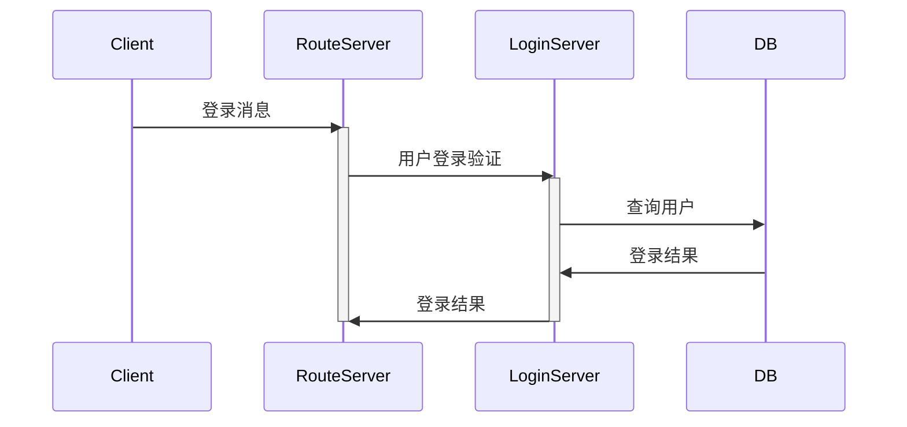

# 安装依赖

执行 `third_party` 下的 `.sh` 文件安装依赖。

- poco-1.13.3-release
- protobuf-3.21.12

# 服务端方案

## RouteServer

RouteServer 主要负责路由和消息转发，过滤无效消息。

与其他组件通过TCP传输。

## 登录流程

1. 客户端发送登录消息到 RouteServer；
2. RouteServer 收到登录消息，发送给 LoginServer 验证

# 协议说明

## IM.BaseType

