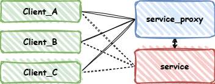

# 安装依赖

执行 `third_party` 下的 `.sh` 文件安装依赖。

- poco-1.13.3-release
- protobuf-3.21.12

# 服务端方案

## 通信方式

客户端和服务端使用 TCP 建立长连接。

各服务端实例之间需要一个消息中间件，用于在不同服务实例之间转发消息，需要能够支持大量消息的快速转发。

服务端实例中的各服务之间需要更便捷、轻量的消息队列实现异步消息传送。这里选用 ZeroMQ，ZeroMQ 是一个高性能异步消息库，
提供消息队列而且不需要单独的消息队列服务器。

1. 客户端向服务代理（service_proxy）订阅服务； 
2. 服务端上线后每1s向服务代理发布服务状态； 
3. 服务代理将服务状态转发到各客户端；
4. 客户端根据服务状态中的地址连接到服务端进行消息收发。

## 消息编解码

具体的消息体在“Protocol.md”中描述，这里只说明消息编解码中可能遇到的问题：
1. MessageFactory::generated_factory() 生成的 Message 是指针，使用 shared_ptr<Message> 自动管理其生命周期。
2. TCP 接收消息错误如何处理。如果接收到消息长度异常、checkSum不正确、消息类型无法识别或消息解析错误等异常，
应该断开与客户端的连接，让客户端重连重试。

## conn_server

conn_server 作为服务端和客户端的接入层，主要提供TCP长连接管理和业务消息分发功能。

- **连接管理**：维护客户端和服务端之间的长连接，通过心跳包检测客户端是否保持连接，如果未收到心跳包则认为用户已经下线，
向 account_server 发送用户下线消息后断开与客户端的 TCP 连接。
- **业务消息分发**：根据客户端消息类型分发到不同业务进程处理。
- **消息推送**：接收各业务上报的消息后，查询到目标用户连接后发送。

消息分发器设计：在 conn_server 配置文件中注册各组件的服务地址和消息类型名，根据消息类型挂载各服务的消息转发回调。
各服务组件提供消息队列客户端接口，并在转发回调中调用。

## account_server

account_server 提供与用户状态相关的服务，包括用户登录、用户在线状态、用户连接服务器地址查询等服务。

- **用户登录**：conn_server 收到客户端登录消息后转发给 account_server 进行登录鉴权，登录成功后回复客户端应答消息。
- **用户状态**：conn_server 会定期同步用户离线消息。
- **用户连接查询**：route_server 处理 IM 消息时向 conn_server 查询发送目的用户的连接服务实例。

## route_server

route_server 作为与其他 IMServer 的交互层，接收 conn_server 下发的 IM 消息，向 account_server 查询到目标用户
所在连接服务实例后，转发消息到对应服务实例的 route_server。

- **IM消息转发**：查询目标用户所在服务实例后进行消息转发，如果用户在本地服务实例，直接加入本地消息队列中进行处理。
- **IM消息接收**：接收消息队列中的消息，并发送到 msg_server 进程向客户端推送消息。

## msg_server

msg_server 提供 IM 消息处理服务

## db_proxy

db_proxy 作为数据库代理，提供查库和写库功能，读写分离