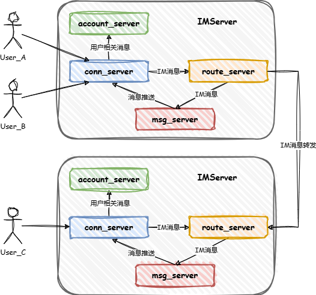

# 安装依赖

执行 `third_party` 下的 `.sh` 文件安装依赖。

- poco-1.13.3-release
- protobuf-3.21.12

# 服务端方案

服务间的通讯方式：
- 获取状态可以直接使用 grpc 调用对应服务接口。
- 如果是写状态，直接发送到消息队列即可，不需要等待对端应答结果。

## conn_server

conn_server 作为服务端和客户端的接入层，主要提供TCP长连接管理和业务消息分发功能。

- **连接管理**：维护客户端和服务端之间的长连接，通过心跳包检测客户端是否保持连接，如果未收到心跳包则认为用户已经下线，
向 account_server 发送用户下线消息后断开与客户端的 TCP 连接。
- **业务消息分发**：根据客户端消息类型分发到不同业务进程处理。
- **消息推送**：接收各业务上报的消息后，查询到目标用户连接后发送。

## account_server

account_server 提供与用户状态相关的服务，包括用户登录、用户在线状态、用户连接服务器地址查询等服务。

- **用户登录**：conn_server 收到客户端登录消息后转发给 account_server 进行登录鉴权，登录成功后回复客户端应答消息。
- **用户状态**：conn_server 会定期同步用户离线消息。
- **用户连接查询**：route_server 处理 IM 消息时向 conn_server 查询发送目的用户的连接服务实例。

## route_server

route_server 作为与其他 IMServer 的交互层，接收 conn_server 下发的 IM 消息，向 account_server 查询到目标用户
所在连接服务实例后，转发消息到对应服务实例的 route_server。

- **IM消息转发**：查询目标用户所在服务实例后进行消息转发，如果用户在本地服务实例，直接加入本地消息队列中进行处理。
- **IM消息接收**：接收消息队列中的消息，并发送到 msg_server 进程向客户端推送消息。

## msg_server

msg_server 提供 IM 消息处理服务

