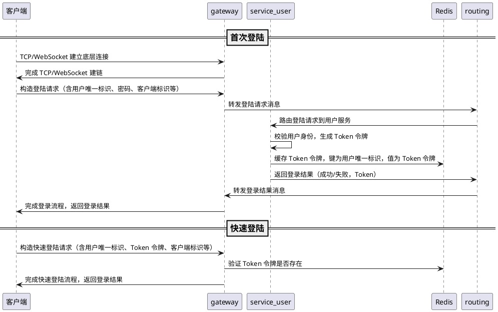

# 用户登陆实现方案

IM 服务器的用户登录核心是**客户端与服务器的身份认证交互**，实现 “客户端发起登录请求 - 服务器校验身份 - 返回登录结果 - 建立有效连接” 的完整流程，同时兼顾传输安全、状态管理和异常处理。

## 核心交互流程

登录是 IM 连接建立后的首次身份认证环节，需保证步骤轻量、认证可靠。具体流程：



1. 客户端与服务器通过 TCP/WebSocket 建立底层连接;
   - 客户端建链成功后，立即发送登录请求；服务端超过 5s 未收到登录请求，认为建链失败，主动关闭连接。
2. 客户端构造**登录请求体**（含用户唯一标识、密码 / 令牌、客户端标识等）；
   - 首次登录：包含用户唯一标识、密码、客户端标识等；
   - 快速登录：包含用户唯一标识、Token 令牌、客户端标识等；
3. 服务器网关接收请求，发送给消息路由层转发到用户服务进行验证。
4. 验证完成后构造**登陆响应体**（含登录成功 / 失败状态、错误码、成功后分配的连接 ID 等）返回给客户端。
5. 客户端接收响应，根据状态做后续处理：
   - 成功：保存链接状态，服务器分配的 Token 令牌，进入 IM 正常通信阶段（收发消息和心跳包等）；
   - 失败：提示用户错误原因，可以重新建链选择登录。
6. 服务器登录成功后，维护连接和用户的绑定关系，初始化用户相关状态（在线状态、好友列表等缓存）。

## 登录通信协议

IM 通信需定制**轻量、可解析**的私有协议（避免 HTTP 的无状态、高开销问题），协议包含**消息头 + 消息体**，登录请求 / 响应是协议的具体消息类型。

### 通用协议结构

服务器长连接支持 TCP、WebSocket 协议。

#### TCP 协议

TCP协议采用固定长度的消息头+可变长度的消息体结构。定长消息头用于快速解析，不定长消息体存储具体业务数据，适配不同消息类型（登录、聊天、心跳）。

```shell
+----------------+----------------+------------+-----------+
|  total_length  |  message_type  | version    | reserved  |
+----------------+----------------+------------+-----------+
|                          body                            |
+----------------------------------------------------------+
```

详细字段如下：

|    字段名    | 数据类型 |    占用字节    |           取值范围 / 用途           |
| :----------: | :------: | :------------: | :---------------------------------: |
| total_length | uint32_t |     4 字节     |    无符号 32 位，标识消息总长度     |
| message_type | uint16_t |     2 字节     |     无符号 16 位，标识消息类型      |
|   version    | uint8_t  |     1 字节     |   无符号 8 位，协议版本（0-255）    |
|   reserved   | uint8_t  |     1 字节     |  无符号 8 位，保留字段（暂未使用）  |
|     data     |  byte*   | total_length-8 | 业务数据，采用 JSON/Protobuf 序列化 |

#### WebSocket 协议

WebSocket协议使用标准的WebSocket帧结构，消息内容采用JSON格式。

```shell
 0                   1                   2                   3
 0 1 2 3 4 5 6 7 8 9 0 1 2 3 4 5 6 7 8 9 0 1 2 3 4 5 6 7 8 9 0 1
 +-+-+-+-+-------+-+-------------+-------------------------------+
 |F|R|R|R| opcode|M| Payload len |    Extended payload length    |
 |I|S|S|S|  (4)  |A|     (7)     |             (16/64)           |
 |N|V|V|V|       |S|             |   (if payload len==126/127)   |
 | |1|2|3|       |K|             |                               |
 +-+-+-+-+-------+-+-------------+ - - - - - - - - - - - - - - - +
 |                               data                            |
 +---------------------------------------------------------------+
```

详细字段如下：

|     字段名     | 数据类型 | 占用字节 |                       取值范围 / 用途                        |
| :------------: | :------: | :------: | :----------------------------------------------------------: |
|      FIN       |  biit7   |   1 位   |                 标识消息是否完整（分片传输）                 |
| RSV1/RSV2/RSV3 |  bit6-4  |   3 位   | 协议扩展预留，默认全 0。0 = 未使用，非 0 = 扩展协议使用（如压缩、自定义扩展） |
|     Opcode     |  bit3-0  |   4 位   |           标识帧的业务类型（文本 / 二进制 / 控制）           |
|      MASK      |  biit7   |   1 位   | 标识载荷是否需要掩码解码，0 = 无掩码，1 = 有掩码（**客户端→服务端必须为 1，服务端→客户端必须为 0**） |
|  Payload len   |  bit6-0  |   7 位   |                       变长编码载荷长度                       |

### 登录请求响应体

登录请求体核心携带身份认证信息和客户端基础信息：

```json
{
    "userId ": "123456",      // 用户唯一标识，账号ID或手机号
    "password": "123456",     // 密码或令牌，首次登录包含密码，快速登录包含令牌
    "clientType ": "123456",  // 客户端唯一标识
    "deviceId": "123456",     // 设备唯一标识，用于区分不同客户端（如 PC、移动端等）
    "appVersion": "1.0.0" // 客户端版本号（如 1.0.0）
}
```

登录响应体核心包含认证结果、连接 ID 和令牌 Token 等信息：

```json
{
    "code": 0,                  // 状态码，0 = 成功，非 0 = 失败
    "msg": "success",           // 状态描述，成功时为 "success"，失败时为错误信息
    "connId": "123456",         // 服务器分配的连接 ID，用于后续通信
    "loginTime": 1694500000000, // 登录成功时间戳（毫秒级）
    "token": "123456"           // 登录成功后返回的 Token 令牌，后续通信需携带
}
```