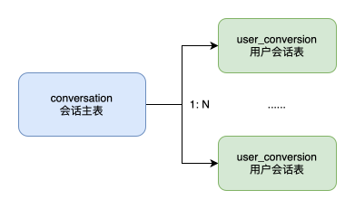
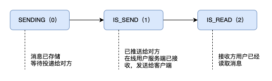
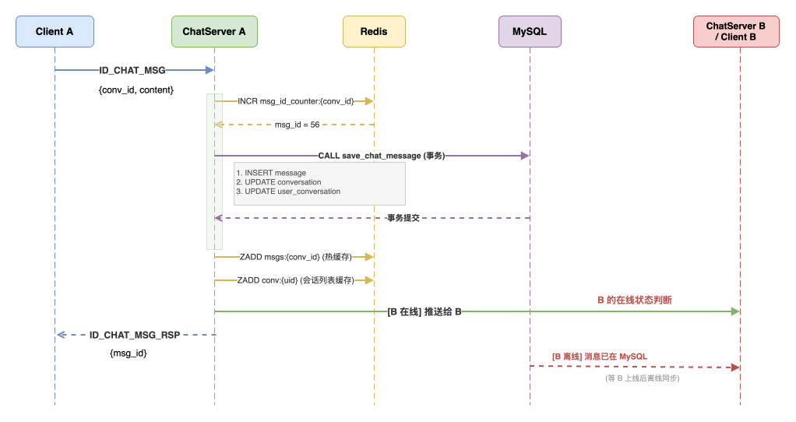

# 聊天会话需求设计


## 目录

1. [需求背景](#1-需求背景)
2. [核心概念](#2-核心概念)
3. [数据模型](#3-数据模型)
4. [会话 ID 规则](#4-会话-id-规则)
5. [消息生命周期](#5-消息生命周期)
6. [存储过程](#6-存储过程)
7. [Redis 缓存设计](#7-redis-缓存设计)
8. [接口协议](#8-接口协议)
9. [未读计数策略](#9-未读计数策略)
10. [离线消息同步](#10-离线消息同步)
11. [数据结构定义（C++）](#11-数据结构定义c)
12. [实现清单](#12-实现清单)
13. [验证方案](#13-验证方案)

---

## 1. 需求背景

### 1.1 什么是聊天会话模块

聊天会话（Conversation）是 IM 系统中连接"消息"与"用户"的核心枢纽。它解决两个基本问题：

**对用户而言**："我和谁聊过天？上次聊到哪了？有没有新消息？"
**对系统而言**："消息发给哪个会话？未读数怎么算？离线消息怎么补？"

具体来说，会话模块承担以下职责：

| 职责 | 说明 |
|------|------|
| **会话管理** | 创建 C2C 会话、管理会话元信息（最后一条消息摘要、会话状态） |
| **消息收发** | 在会话内发送消息、转发给在线/离线接收方、追踪送达与已读状态 |
| **会话列表** | 提供用户维度的"最近联系人"列表，支持增量分页加载 |
| **历史消息** | 支持进入会话后向上翻页拉取更早的消息（游标分页） |
| **未读计数** | 精确追踪每个用户在每个会话中"还有多少条未读"，进入会话后自动清零 |
| **离线同步** | 用户离线期间的消息在重新上线后补齐，按未读数量阈值选择推送策略 |
| **个性化设置** | 置顶、免打扰、删除会话（仅影响当前用户） |

### 1.2 设计目标

1. **数据可靠**：MySQL 持久化为主，Redis 做热缓存，Redis 重启不丢数据
2. **模型清晰**：会话主表（共享）与用户会话表（私有）分离，群聊扩展自然
3. **体验完整**：覆盖会话列表、历史消息、标记已读、离线同步全链路
4. **性能可控**：固定分页大小、冷热数据分层、冗余字段消除高频 COUNT

---

## 2. 核心概念

### 2.1 两张表，两个视角

本模块最核心的设计是 **将会话的"公共属性"与"用户私有属性"分离**：



- 会话主表：所有参与方共享：last_msg、状态 ...... 等，一个会话只有一条记录。
- 用户会话表：每个用户独立拥有自己的用户会话，保存未读消息和用户对会话的设置。对于群组会话，有多少成员就有多少条记录。

**为什么这样设计？**

- A 把会话置顶，B 不受影响
- A 删除会话，B 的聊天记录还在
- 群聊的群名、公告只存一份，成员设置各自维护

### 2.2 关键设计速览

| 维度 | 决策 | 简要理由 |
|------|------|----------|
| msg_id 生成方 | 服务端（Redis INCR） | 避免多客户端碰撞 |
| 消息存储 | MySQL 主 + Redis 缓存 | 持久化 + 热数据加速 |
| 历史分页 | 游标（cursor_msg_id） | 避免新消息导致重复 |
| 会话列表 | 增量（update_time） | 减少全量加载开销 |
| 未读追踪 | `last_read_msg_id` + 冗余 `unread_count` | 精确 + 快速 |
| 删除行为 | 软删除 `is_deleted` | 用户间互不影响 |
| 群聊 | `conv_type=2` 预留 | 不增加第一期复杂度 |

---

## 3. 数据模型

### 3.1 会话主表 `conversation`

存储会话本身的信息，**所有参与方共享同一条记录**。

```sql
CREATE TABLE `conversation` (
  `conv_id` varchar(64) NOT NULL COMMENT '会话唯一ID，C2C格式: c2c_{小uid}_{大uid}',
  `conv_type` tinyint NOT NULL COMMENT '会话类型 1:C2C,2:Group(预留)',
  `status` tinyint NOT NULL DEFAULT 0 COMMENT '会话状态 0:正常,1:已解散',
  `last_msg_id` int DEFAULT 0 COMMENT '最新消息ID',
  `last_msg_content` text COMMENT '最新消息摘要',
  `last_time` datetime(6) DEFAULT NULL COMMENT '最新消息时间',
  `create_time` datetime DEFAULT CURRENT_TIMESTAMP,
  `update_time` datetime DEFAULT CURRENT_TIMESTAMP ON UPDATE CURRENT_TIMESTAMP,
  PRIMARY KEY (`conv_id`),
  KEY `idx_update_time` (`update_time`)
) ENGINE=InnoDB DEFAULT CHARSET=utf16 COMMENT='IM会话主表';
```

**字段说明**：

- `conv_id`: 会话唯一标识。C2C 格式为 `c2c_{较小uid}_{较大uid}`，由客户端生成，服务端校验合法性。
- `conv_type`: 1=C2C, 2=Group
- `status`: 0=正常, 1=已解散（群聊解散或管理员关停会话时使用）
- `last_msg_*` 三个字段存储最新一条消息的摘要，写入消息时同步更新，所有成员共用。
- `update_time` 由数据库自动维护，客户端用来增量拉取会话。

### 3.2 用户会话表 `user_conversation`

存储 **每个用户对每个会话的私有状态**。每个用户对会话的设置和阅读状态，删除、置顶和免打扰等操作只对本人影响。

```sql
CREATE TABLE `user_conversation` (
  `id` int NOT NULL AUTO_INCREMENT COMMENT '主键ID',
  `uid` int NOT NULL COMMENT '用户ID',
  `conv_id` varchar(64) NOT NULL COMMENT '会话ID',
  `last_read_msg_id` int DEFAULT 0 COMMENT '最后已读消息ID，0表示无已读消息',
  `unread_count` int DEFAULT 0 COMMENT '未读消息数（冗余，避免每次COUNT）',
  `is_top` tinyint DEFAULT 0 COMMENT '是否置顶 0:否,1:是',
  `is_mute` tinyint DEFAULT 0 COMMENT '是否免打扰 0:否,1:是',
  `is_deleted` tinyint DEFAULT 0 COMMENT '是否已删除 0:否,1:是（软删除）',
  `create_time` datetime DEFAULT CURRENT_TIMESTAMP,
  `update_time` datetime DEFAULT CURRENT_TIMESTAMP ON UPDATE CURRENT_TIMESTAMP,
  PRIMARY KEY (`id`),
  UNIQUE KEY `idx_user_conv` (`uid`, `conv_id`),
  KEY `idx_uid_updatetime` (`uid`, `update_time`)
) ENGINE=InnoDB DEFAULT CHARSET=utf16 COMMENT='IM用户会话表';
```

**字段说明**：

- **`last_read_msg_id`** 精确标记用户读到的位置。用它计算未读数：`COUNT(msg_id > last_read_msg_id)`
- **`unread_count`** 是为了避免每次进会话列表都 COUNT。由存储过程在收发消息时自动维护
- **`is_deleted`** 软删除标记。用户删除会话后不再出现在列表，但对方不受影响
- **`update_time`** 在以下时机更新：新消息到达、用户标记已读、修改设置。用作增量分页的游标

### 3.3 消息表 `message`

消息 ID 由服务端在数据库中自动生成，所有客户端统一使用服务端生成的消息 ID。

```sql
CREATE TABLE `message` (
  `id` int NOT NULL AUTO_INCREMENT COMMENT '主键ID',
  `conv_id` varchar(64) NOT NULL COMMENT '所属会话',
  `sender_uid` int NOT NULL COMMENT '发送者用户ID',
  `msg_type` tinyint NOT NULL COMMENT '消息类型 1:文本,2:图片/文件',
  `content` text COMMENT '消息内容/资源URL',
  `msg_id` int NOT NULL COMMENT '会话内消息ID（服务端生成，自增）',
  `status` tinyint DEFAULT '0' COMMENT '消息状态 0:SENDING,1:IS_SEND,2:IS_READ',
  `create_time` datetime(6) DEFAULT CURRENT_TIMESTAMP(6) COMMENT '创建时间',
  PRIMARY KEY (`id`),
  UNIQUE KEY `idx_conv_msg` (`conv_id`, `msg_id`)
) ENGINE=InnoDB DEFAULT CHARSET=utf16 COMMENT='IM消息表';
```

**msg_id 生成规则**：
- 每个会话独立自增，由服务端通过 Redis `INCR msg_id_counter:{conv_id}` 生成。
- `conv_id` + `msg_id` 联合唯一，不同会话的 msg_id 互不干扰。
- 游标分页和 `last_read_msg_id` 均基于此 msg_id。

---

## 4. 会话 ID 规则

### 4.1 C2C 格式私聊会话

```
c2c_{较小uid}_{较大uid}
```

**示例**：

| uid A | uid B | conv_id |
|-------|-------|---------|
| 3 | 7 | `c2c_3_7` |
| 100 | 5 | `c2c_5_100` |

### 4.2 从 conv_id 反推对方 uid

无需查表，直接字符串解析：

```
给定 conv_id = "c2c_3_7"，已知 uid = 3 → 对方 = 7
给定 conv_id = "c2c_3_7"，已知 uid = 7 → 对方 = 3
给定 conv_id = "c2c_3_7"，已知 uid = 5 → 非法，不在会话中
```

### 4.3 服务端校验流程

客户端发送 `ID_CHAT_CONVERSATION_REQ` 创建会话时，服务端校验：

1. **格式校验**：conv_id 符合 `c2c_\\d+_\\d+` 正则
2. **UID 归属校验**：两个 UID 中必须包含请求方自身
3. **权限校验**：查询对方 `user_profile.privacy_chat`，若为 0（禁止陌生人私信）且双方非好友，则拒绝创建


---

## 5. 消息生命周期

### 5.1 状态流转



| 状态 | 值 | 设置时机 | 准确度 |
|------|-----|----------|--------|
| `SENDING` | 0 | 消息写入 MySQL 时 | 精确 |
| `IS_SEND` | 1 | 服务端 `session->asyncSend()` 调用完成 | 近似（TCP 缓冲区满则可能未达客户端） |
| `IS_READ` | 2 | 接收方调用标记已读接口 | 精确 |

注意事项：
- `IS_SEND` 表示服务端已推送到接收方的 TCP 发送缓冲区，不代表客户端 App 已渲染
- 跨 ChatServer 转发时，本服务器只跟踪到推送完成为止
- 状态更新为 `IS_READ` 时，同步更新 `user_conversation.last_read_msg_id` 和 `unread_count`

### 5.2 发送全流程



### 5.3 msg_id 生成细节

```cpp
// 服务端生成 msg_id（原子操作）
int msg_id = RedisMgr::getInstance()->incr("msg_id_counter:" + conv_id);
// 将 msg_id 传入 save_chat_message 存储过程
```

**Redis 计数器恢复**：如果 Redis 重启丢失计数器，从 MySQL 恢复：

```sql
SELECT COALESCE(MAX(msg_id), 0) FROM message WHERE conv_id = ?;
```

---

## 6. 存储过程

### 6.1 创建会话 `create_conversation`

**调用时机**：客户端发送 `ID_CHAT_CONVERSATION_REQ`，服务端校验通过后调用。

**行为**：
- 若 `conversation` 主表不存在该 `conv_id`，则插入（幂等）
- 为双方各插入一条 `user_conversation`（`ON DUPLICATE KEY` 保证幂等，且重置 `is_deleted`）

```sql
CREATE PROCEDURE `create_conversation`(
    IN  `p_conv_id` VARCHAR(64),
    IN  `p_uid1`    INT,
    IN  `p_uid2`    INT,
    OUT `result`    INT
)
BEGIN
    DECLARE EXIT HANDLER FOR SQLEXCEPTION BEGIN ROLLBACK; SET result = -1; END;
    START TRANSACTION;

    -- 会话主表不存在则创建
    IF NOT EXISTS (SELECT 1 FROM `conversation` WHERE `conv_id` = p_conv_id) THEN
        INSERT INTO `conversation` (`conv_id`, `conv_type`, `status`)
        VALUES (p_conv_id, 1, 0);
    END IF;

    -- 双方各创建用户会话（已删除的则恢复）
    INSERT INTO `user_conversation` (`uid`, `conv_id`, `last_read_msg_id`, `unread_count`)
    VALUES (p_uid1, p_conv_id, 0, 0)
    ON DUPLICATE KEY UPDATE `is_deleted` = 0, `update_time` = NOW();

    INSERT INTO `user_conversation` (`uid`, `conv_id`, `last_read_msg_id`, `unread_count`)
    VALUES (p_uid2, p_conv_id, 0, 0)
    ON DUPLICATE KEY UPDATE `is_deleted` = 0, `update_time` = NOW();

    SET result = 0;
    COMMIT;
END
```

### 6.2 保存消息 `save_chat_message`

**关键设计**：

- `msg_id` 由服务端生成，完成消息投递后返回给客户端，客户端在本地存储消息。
- 收到会话消息后更新主表的 `last_*` 状态。
- 接收方未读计数 `user_conversation.unread_count` 增加。

**行为（单个事务内）**：
1. 幂等检查：`conv_id` + `msg_id` 已存在则跳过
2. 插入 `message` 表
3. 更新会话主表 `conversation` 的最后消息摘要
4. 更新发送方 `user_conversation.update_time`
5. 更新接收方 `unread_count += 1`；若无会话记录则自动创建

```sql
CREATE PROCEDURE `save_chat_message`(
    IN  `p_conv_id`   VARCHAR(64),
    IN  `sender_uid`  INT,
    IN  `recver_uid`  INT,
    IN  `msg_type`    TINYINT,
    IN  `msg_id`      INT,          -- 服务端生成的会话内自增ID
    IN  `stat`        TINYINT,
    IN  `content`     TEXT,
    OUT `result`      INT
)
BEGIN
    DECLARE EXIT HANDLER FOR SQLEXCEPTION BEGIN ROLLBACK; SET result = -1; END;
    START TRANSACTION;

    IF EXISTS (SELECT 1 FROM `message` WHERE `conv_id` = p_conv_id AND `msg_id` = msg_id) THEN
        SET result = 1;   -- 幂等：消息已存在
        COMMIT;
    ELSE
        INSERT INTO `message` (`conv_id`, `sender_uid`, `msg_type`, `content`, `msg_id`, `status`)
        VALUES (p_conv_id, sender_uid, msg_type, content, msg_id, stat);

        UPDATE `conversation`
        SET `last_msg_id` = msg_id, `last_msg_content` = content, `last_time` = NOW()
        WHERE `conv_id` = p_conv_id;

        UPDATE `user_conversation`
        SET `update_time` = NOW()
        WHERE `conv_id` = p_conv_id AND `uid` = sender_uid;

        IF EXISTS (SELECT 1 FROM `user_conversation` WHERE `uid` = recver_uid AND `conv_id` = p_conv_id) THEN
            UPDATE `user_conversation`
            SET `unread_count` = `unread_count` + 1, `update_time` = NOW()
            WHERE `conv_id` = p_conv_id AND `uid` = recver_uid;
        ELSE
            INSERT INTO `user_conversation` (`uid`, `conv_id`, `unread_count`, `last_read_msg_id`)
            VALUES (recver_uid, p_conv_id, 1, 0);
        END IF;

        SET result = 0;
    END IF;
    COMMIT;
END
```

---

## 7. Redis 缓存设计

### 7.1 Key 一览

| Key | 类型 | 用途 | 生命周期 |
|-----|------|------|----------|
| `conv:{conv_id}` | Hash | 会话主表缓存 | 无 TTL，写穿透更新 |
| `user_conv:{uid}` | Sorted Set | 用户会话列表（score=`update_time` 毫秒戳） | 保留最近 200 个会话 |
| `unread:{uid}:{conv_id}` | String | 未读计数快照 | 跟 MySQL 同步更新 |
| `msg_id_counter:{conv_id}` | String | 会话内 msg_id 自增 | 持久，重启从 MySQL 恢复 |
| `msgs:{conv_id}` | Sorted Set | 最近 100 条消息缓存（score=`msg_id`） | 超出 100 自动裁剪 |

### 7.2 缓存策略

#### 会话主表

- **写入**：写穿透（先写 MySQL，成功后再写 Redis Hash）
- **读取**：先查 Redis，未命中则查 MySQL 并回填 Redis
- **失效**：不设 TTL，更新时覆盖

#### 会话列表

- **写入**：消息到达或设置变更后，更新 MySQL `update_time`，同时 `ZADD user_conv:{uid}` 以 `update_time` 的时间戳为 score
- **读取**：`ZREVRANGEBYSCORE user_conv:{uid}` 按时间戳范围分页
- **容量控制**：每个用户最多保留 200 个会话在 Sorted Set 中（`ZREMRANGEBYRANK` 清理尾部）
- **重建**：Redis 未命中时，从 MySQL 全量加载并重建

#### 消息缓存

- **写入**：消息持久化到 MySQL 后，`ZADD msgs:{conv_id}` 以 msg_id 为 score
- **读取**：`ZREVRANGEBYSCORE msgs:{conv_id}` 按 msg_id 范围查询
- **容量控制**：保留最近 100 条，超出部分自动裁剪
- **穿透**：游标指向的 msg_id 不在 Redis 中时，直接查 MySQL

---

## 8. 接口协议

所有接口使用 IMServer 自定义 TCP 二进制协议：**4 字节头（2B msgId + 2B bodySize）+ JSON 体**。

### 8.1 消息 ID 定义

```cpp
ID_CHAT_CONVERSATION_REQ = 4001,   // 创建会话
ID_CHAT_CONVERSATION_RSP = 4002,
ID_CONV_HISTORY_MSG_REQ  = 4003,   // 历史消息（已有定义，无 handler）
ID_CONV_HISTORY_MSG_RSP  = 4004,
ID_CONV_LIST_REQ         = 4005,   // 会话列表（增量）
ID_CONV_LIST_RSP         = 4006,
ID_CONV_MARK_READ_REQ    = 4007,   // 标记已读
ID_CONV_MARK_READ_RSP    = 4008,
ID_CONV_SETTING_REQ      = 4009,   // 会话设置（置顶/免打扰）
ID_CONV_SETTING_RSP      = 4010,
ID_OFFLINE_SYNC_REQ      = 4011,   // 离线同步
ID_OFFLINE_SYNC_RSP      = 4012,
```

### 8.2 创建会话

> `ID_CHAT_CONVERSATION_REQ (4001)` → `ID_CHAT_CONVERSATION_RSP (4002)`

```json
// → 请求
{ "uid": 3, "conv_id": "c2c_3_7" }

// ← 成功
{
  "error": 0,
  "conv_id": "c2c_3_7",
  "conv_type": 1,
  "status": 0,
  "last_msg_id": 0,
  "last_msg_content": "",
  "last_time": "2026-06-27 10:00:00.000000",
  "create_time": "2026-06-27 10:00:00"
}

// ← 对方禁止私信
{ "error": 4001, "conv_id": "c2c_3_7" }
```

服务端处理流程：
1. 解析 JSON，提取 `uid`、`conv_id`
2. 校验 conv_id 格式
3. 从 conv_id 解析对方 uid，校验请求方 UID 在会话中
4. 查询对方 `user_profile.privacy_chat`，校验权限
5. 调用 `create_conversation` 存储过程
6. 更新 Redis 缓存
7. 返回完整会话信息

### 8.3 会话列表（增量分页）

> `ID_CONV_LIST_REQ (4005)` → `ID_CONV_LIST_RSP (4006)`

客户端维护一个 `last_update_time`，每次请求带上，服务端只返回比它更新的会话。首次传空字符串或 `"0000-00-00 00:00:00"`。

```json
// → 请求
{
  "uid": 3,
  "last_update_time": "2026-06-27 00:00:00"
}

// ← 响应
{
  "error": 0,
  "has_more": true,
  "convs": [
    {
      "conv_id": "c2c_3_7",
      "conv_type": 1,
      "last_msg_id": 52,
      "last_msg_content": "你好",
      "last_time": "2026-06-27 12:30:00.500000",
      "unread_count": 3,
      "is_top": 0,
      "is_mute": 0,
      "update_time": "2026-06-27 12:30:00.500000"
    }
  ]
}
```

**分页逻辑**：

```
SQL: SELECT * FROM user_conversation
     WHERE uid = ? AND is_deleted = 0 AND update_time > ?
     ORDER BY update_time DESC
     LIMIT 51

返回前 50 条；第 51 条存在 → has_more = true
客户端用最后一条的 update_time 作为下次请求的游标
```

### 8.4 历史消息（游标分页）

> `ID_CONV_HISTORY_MSG_REQ (4003)` → `ID_CONV_HISTORY_MSG_RSP (4004)`

游标分页，避免偏移量分页在插入新消息时出现重复。每次翻页取更早的消息。

```json
// → 请求（首次传 INT_MAX 或不传 cursor_msg_id）
{ "uid": 3, "conv_id": "c2c_3_7", "cursor_msg_id": 50 }

// ← 响应
{
  "error": 0,
  "has_more": true,
  "messages": [
    { "msg_id": 49, "sender_uid": 7, "msg_type": 1, "content": "好的", "status": 2, "create_time": "2026-06-27 13:00:00" },
    { "msg_id": 48, "sender_uid": 3, "msg_type": 1, "content": "在吗", "status": 2, "create_time": "2026-06-27 13:00:00" }
  ]
}
```

**分页逻辑**：

```
SQL: SELECT * FROM message
     WHERE conv_id = ? AND msg_id < cursor_msg_id
     ORDER BY msg_id DESC
     LIMIT 21

返回前 20 条；第 21 条存在 → has_more = true
客户端用最后一条的 msg_id 作为下次请求的 cursor_msg_id
```

### 8.5 标记已读

> `ID_CONV_MARK_READ_REQ (4007)` → `ID_CONV_MARK_READ_RSP (4008)`

```json
// → 请求
{ "uid": 3, "conv_id": "c2c_3_7", "msg_id": 55 }

// ← 响应
{ "error": 0 }
```

**触发时机**：
- **自动**：进入会话并拉取历史消息时，附带标记最新 `msg_id` 为已读
- **手动**：滚动到指定位置时，精确标记

### 8.6 会话设置

> `ID_CONV_SETTING_REQ (4009)` → `ID_CONV_SETTING_RSP (4010)`

第一期仅支持 `is_top` 和 `is_mute`，后续扩展会话设置，例如删除会话的逻辑。

```json
// → 请求
{ "uid": 3, "conv_id": "c2c_3_7", "is_top": 1, "is_mute": 0 }

// ← 响应
{ "error": 0 }
```

### 8.7 离线消息同步

> `ID_OFFLINE_SYNC_REQ (4011)` → `ID_OFFLINE_SYNC_RSP (4012)`

```json
// → 请求（客户端上线后按会话粒度同步）
{ "uid": 3, "conv_id": "c2c_3_7", "last_read_msg_id": 45 }

// ← 响应
{
  "error": 0,
  "unread_count": 10,
  "messages": [
    { "msg_id": 46, "sender_uid": 7, "msg_type": 1, "content": "你好", "status": 1, "create_time": "2026-06-27 13:00:00" }
  ]
}
```

离线消息同步策略：客户端在登录后主动发送消息给服务端获取会话消息，也可在客户端会话中上拉同步离线消息。

1. 用户登录后，遍历该用户的 `user_conversation` 记录，检查每个会话的 `unread_count`
2. **未读 < 50 条**：将该会话的未读消息（`msg_id > last_read_msg_id`）主动推送给客户端
3. **未读 >= 50 条**：不推送消息内容，只推送会话列表（含未读数），客户端进入会话后通过 `ID_CONV_HISTORY_MSG_REQ` 按需拉取
4. 客户端也可主动发送 `ID_OFFLINE_SYNC_REQ` 按会话粒度同步

---

## 9. 未读计数策略

### 9.1 计算方式

```
精确未读数 = COUNT(msg_id > last_read_msg_id) WHERE conv_id = ?
```

`user_conversation.unread_count` 是冗余字段，避免每次进列表都 COUNT。

### 9.2 更新时机

| 事件 | 对 `unread_count` 的影响 |
|------|--------------------------|
| A 给 B 发消息 | B 的 `unread_count += 1`（存储过程自动处理） |
| B 标记已读 | 重新计算：`unread_count = COUNT(msg_id > new_last_read_msg_id)` |
| B 发消息给 A | B 的 `unread_count` 不变（不增加己方未读） |

### 9.3 一致性保证

- 存储过程在事务内原子更新，MySQL 层保证准确性
- Redis `unread:{uid}:{conv_id}` 作为缓存副本，标记已读时同步更新
- Redis 缓存丢失时，从 MySQL `user_conversation.unread_count` 恢复

---

## 10. 离线消息同步

### 10.1 策略：按未读数阈值分流

用户登录后，遍历其所有会话，根据未读数决定推送方式：

| 未读数量 | 策略 | 理由 |
|----------|------|------|
| < 50 条 | 服务端主动推送消息内容 | 量小，一次性推送不浪费带宽 |
| >= 50 条 | 仅推送会话列表（含未读数），用户点进去再拉 | 量大，用户可能不关心历史堆积 |

### 10.2 在 `loginHandle` 中的实现要点

```cpp
// 伪代码：登录后处理离线消息
for (auto& conv : userConversations) {
    if (conv.unread_count < 50 && conv.unread_count > 0) {
        // 拉取未读消息并推送给客户端
        auto messages = getMessagesAfter(conv.conv_id, conv.last_read_msg_id);
        pushToClient(session, messages);
    } else if (conv.unread_count >= 50) {
        // 只推会话列表（含未读数）
        pushConversationList(session, conv);
    }
}
```

---

## 11. 数据结构定义（C++）

### 11.1 ConversationInfo

```cpp
struct ConversationInfo {
    std::string conv_id;            // 会话ID
    uint8_t     conv_type;          // 1:C2C  2:Group
    uint8_t     status;             // 0:正常  1:已解散
    uint8_t     is_top;             // 置顶 0/1
    uint8_t     is_mute;            // 免打扰 0/1
    int         unread_count;       // 未读数（冗余）
    int         last_msg_id;        // 最新消息ID
    int         last_read_msg_id;   // 最后已读消息ID
    std::string last_msg_content;   // 最新消息摘要
    std::string last_time;          // 最新消息时间
    std::string update_time;        // 用户会话更新时间（增量分页游标）
};
```

### 11.2 MessageInfo

```cpp
struct MessageInfo {
    std::string conv_id;
    int         sender_uid;
    int         receiver_uid;
    int         msg_id;
    uint8_t     msg_type;
    uint8_t     status;             // 0:SENDING  1:IS_SEND  2:IS_READ
    uint8_t     pad[2];
    std::string content;
};
```

---

## 12. 实现清单

### 12.1 文件变更总览

| 文件 | 变更内容 |
|------|----------|
| `scripts/IMServer.sql` | 新增 `conversation` 表、修改 `user_conversation` 表、新增 `create_conversation` 存储过程、改造 `save_chat_message` 存储过程 |
| `src/base/const.h` | 新增 6 个 MessageID 枚举值（4005-4012） |
| `src/base/UserInfo.h` | 修改 `ConversationInfo` 结构体：移除 `to_uid`，新增 `status`/`last_read_msg_id`/`update_time` |
| `src/base/RedisMgr.h` | 新增 `incr()` 方法、更新 Redis key 宏 |
| `src/ChatServer/db/mysql/MysqlDao.h/.cpp` | 新增 `createConversation`、`getConversation`、`getConversationList`（增量分页）、`getHistoryMessages`（游标分页）、`markRead`、`updateConversationSetting` |
| `src/ChatServer/db/mysql/MysqlMgr.h/.cpp` | 封装上述 DAO 方法 + `getNextMsgId(conv_id)` |
| `src/ChatServer/core/ChatLogicSystem.h/.cpp` | 改造 `conversationCreateHandle` 和 `chatMsgHandle`；新增 5 个 handler；在 `loginHandle` 中加入离线同步逻辑 |

### 12.2 新增/改造的 Handler

| Handler | 关联 ID | 类型 |
|---------|---------|------|
| `conversationCreateHandle` | 4001 | 改造：补全校验 + MySQL 写入 |
| `chatMsgHandle` | 3001 | 改造：服务端生成 msg_id + MySQL 持久化 |
| `conversationListHandle` | 4005 | 新增：增量分页加载 |
| `convHistoryMsgHandle` | 4003 | 新增：游标分页历史消息 |
| `convMarkReadHandle` | 4007 | 新增：标记已读 |
| `convSettingHandle` | 4009 | 新增：置顶/免打扰设置 |
| `offlineSyncHandle` | 4011 | 新增：离线消息同步 |

---

## 13. 验证方案

### 13.1 单元验证

```bash
# 编译
cd cmake-build-debug && ninja
```

### 13.2 数据库验证

```sql
-- 1. 确认表结构
DESC conversation;
DESC user_conversation;

-- 2. 测试存储过程
CALL create_conversation('c2c_3_7', 3, 7, @result);
SELECT @result;  -- 期望: 0

-- 3. 验证幂等
CALL create_conversation('c2c_3_7', 3, 7, @result);
SELECT @result;  -- 期望: 0（不报错）
```

### 13.3 端到端场景

按以下顺序验证，每个步骤检查对应的 MySQL 表和 Redis key：

| 步骤 | 操作 | 验证点 |
|------|------|--------|
| 1 | A 创建与 B 的会话 | `conversation` 有记录，`user_conversation` 双方各有 1 条 |
| 2 | A 发送消息 "hello" | `message` 有记录，`conversation.last_msg` = "hello"，B 的 `unread_count` = 1 |
| 3 | B 拉取会话列表 | 返回含未读数 1 的列表，`has_more` 按预期 |
| 4 | B 拉取历史消息 | 返回 "hello"，`has_more` = false |
| 5 | B 标记已读 | `last_read_msg_id` 更新，`unread_count` = 0 |
| 6 | A 给离线 B 发 3 条消息 | B 的 `unread_count` = 3 |
| 7 | B 上线同步 | 因 < 50 条，自动推送 3 条未读消息 |
